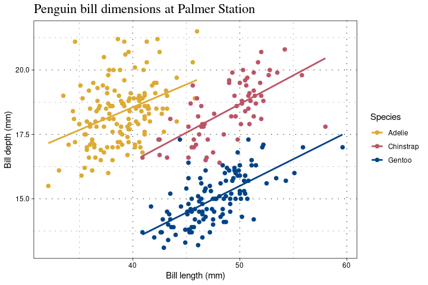

McCall Lab Theme
================
Zachary Brehm

## Installation

This package can be installed using devtools.

``` r
devtools::install_github("zachbrehm/ggmnmlab")
```

## Introduction

This package is currently in development. This package is intended to
provide an easily deployable color palette and theme for ggplot2 for use
by students in the McCall Lab in the Department of Biostatistics at
University of Rochester. The palettes in this package are all intended
to be color blind friendly.

Supports color palettes with 8, 12, 15, or 48 color options. These
palettes were adapted by [Martin
Krzywinski](http://mkweb.bcgsc.ca/colorblind/palettes.mhtml#page-container),
of which the 8 color palette was adapted from [Points of view: Color
Blindness](https://www.nature.com/articles/nmeth.1618) by Bang Wong.
Further updates to this package will include the remaining palettes
displayed on.

``` r
library(ggmnmlab)
#> Loading required package: ggplot2
#> Loading required package: scales
library(palmerpenguins)
```

## Example plots

An example of the 8 color palette and theme is shown here, applied to
the cell-types data from <https://github.com/zachbrehm/celltypes>.

``` r
ggplot(tsneDf, aes(x = X, y = Y, color = Z, text = Project, alpha = 0.8)) + 
  geom_point() + 
  labs(title = "Cell-type data with dimension reduction by TSNE", 
       x = "First Dimension", 
       y = "Second Dimension", 
       color = "Cell-Type",
       text = rse$study) + 
  guides(alpha = FALSE) + 
  scale_color_mnmlab(palette = "martink8",
                         labels = c("Cardiac Muscle", 
                                   "Endothelial", 
                                   "Erythrocyte", 
                                   "Adipocyte", 
                                   "Lymphocyte", 
                                   "Macrophage", 
                                   "Smooth Muscle"),
                        ) +
  theme_mnmlab()
```

<!-- -->

As another example, we recreate the **Bill length vs. depth** example
from the `palmerpenguins` article, this time using the high contrast
palette from Paul Tol:
<https://allisonhorst.github.io/palmerpenguins/articles/examples.html>

``` r
ggplot(
  penguins,
  aes(x = bill_length_mm, y = bill_depth_mm, color = species, group = species)
) +
  geom_point(
    shape = 19, size = 2
  ) +
  geom_smooth(method = "lm", se = FALSE) +
  scale_color_mnmlab(palette = "highContrast") +
  labs(
    title = "Penguin bill dimensions at Palmer Station",
    x = "Bill length (mm)", y = "Bill depth (mm)", color = "Species"
  ) +
  theme_mnmlab()
```

<!-- -->
